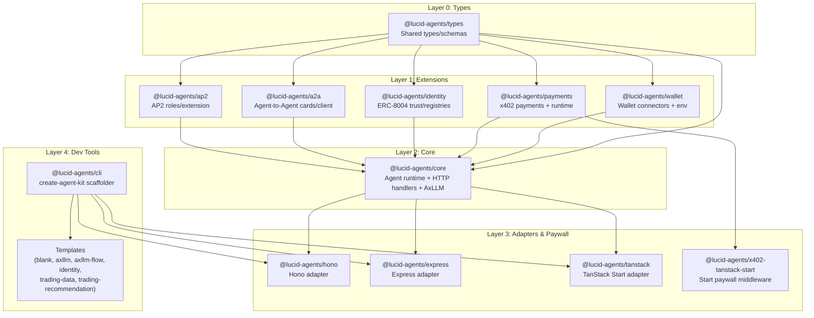

# Lucid Agents — Architecture Overview

This SDK is layered to keep types and runtime concerns isolated and to make adapters/paywalls pluggable.

## Layers

### Layer 0: Types (`@lucid-agents/types`)
Single source of truth for shared types (core runtime, payments, wallets, identity, A2A, AP2). No runtime code.

### Layer 1: Extensions
- `@lucid-agents/wallet`: Local/Lucid wallet connectors, env resolution.
- `@lucid-agents/payments`: x402 pricing/requirements, runtime payment context, manifest stamping, AxLLM wrapper.
- `@lucid-agents/identity`: ERC-8004 trust/registry clients, identity bootstrap.
- `@lucid-agents/a2a`: Agent Card build/fetch/parse, invoke/stream client.
- `@lucid-agents/ap2`: AP2 extension roles/descriptor helpers.

### Layer 2: Core (`@lucid-agents/core`)
Framework-agnostic runtime: entrypoint registry, manifest building (composes A2A + payments + identity + AP2), HTTP handlers (health/entrypoints/manifest/invoke/stream/landing), SSE helpers, AxLLM client (x402-paid).

### Layer 3: Adapters & Paywall
- `@lucid-agents/hono`: Hono router wrapper, auto stream routes, x402-hono paywall integration.
- `@lucid-agents/express`: Express wrapper, web Request/Response bridge, x402-express paywall integration.
- `@lucid-agents/tanstack`: TanStack Start adapter + paywall builder.
- `@lucid-agents/x402-tanstack-start`: Start middleware enforcing x402 payments with HTML paywall fallback.

### Layer 4: Dev Tools
- `@lucid-agents/cli` (binary `create-agent-kit`): interactive/non-interactive scaffolder with adapter selection and templates (blank, axllm, axllm-flow, identity, trading-data, trading-recommendation).

## Key Flows
- **Manifest build:** A2A base card → payments pricing (if active) → identity/trust (if provided) → AP2 extension (defaults to merchant/required when payments active).
- **Payments:** Entry points with prices activate payments runtime; adapters optionally wrap routes with x402 middleware; runtime payment context supports runtime wallet or private key.
- **Identity:** Uses runtime agent wallet to look up/register ERC-8004 identity; trust config stamped into manifest.
- **Adapters:** Adapt core HTTP handlers to framework routing; paywall middleware is opt-in.

## Dependency Notes
- Core imports extensions; adapters import core (and paywall helpers). Types stay leaf-only. No circular deps.
